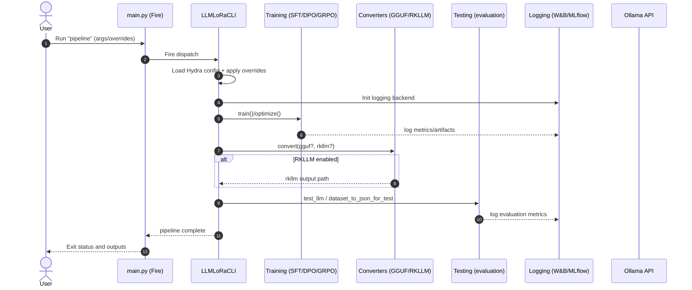

<div align="center">

# 🚀 LLM-LoRa

**Memory-efficient LLM fine-tuning with LoRa and advanced quantization**

[](LICENSE)
[](https://www.python.org/downloads/)
[](https://pytorch.org/)
[](docker-compose.yaml)
[](https://huggingface.co/transformers/)

[Quick Start](#quick-start) • [Features](#features) • [Installation](#installation) • [Documentation](#documentation) • [Examples](#examples)

</div>

## 🎯 Overview

**LLM-LoRa** is a comprehensive framework for memory-efficient fine-tuning of Large Language Models using LoRa (Low-Rank Adaptation) and advanced quantization techniques. Train state-of-the-art LLMs with significantly reduced memory requirements while maintaining performance.

### ✨ Key Benefits

- **🧠 Memory Efficient**: Train large models with up to 70% less GPU memory using LoRa and quantization
- **⚡ Multiple Methods**: Support for SFT (Supervised Fine-Tuning) and GRPO (DeepSeek's method) training
- **🔧 Advanced Quantization**: Built-in support for bitsandbytes quantization (4-bit, 8-bit)
- **🐳 Production Ready**: Full Docker support with GPU acceleration and Ollama integration
- **📊 Experiment Tracking**: Integrated MLflow and Weights & Biases logging
- **⚙️ Flexible Configuration**: Hydra-based configuration management

## 🚀 Quick Start

Get started in under 2 minutes:

### Using Docker (Recommended)

```bash
# Clone the repository
git clone https://github.com/timik232/LLM_LoRa.git
cd LLM_LoRa

# Configure training parameters
cp conf/config.yaml my_config.yaml
# Edit my_config.yaml with your settings

# Start training
docker-compose build
docker-compose up
```

### Using Poetry

```bash
# Install dependencies
poetry install --no-root

# Start training
python main.py
```

### Quick Training Example

```python
# Basic training with default settings
python main.py model.model_name=microsoft/DialoGPT-small

# Custom configuration
python main.py \
  model.model_name=microsoft/DialoGPT-medium \
  model.train_steps=1000 \
  training.learning_rate=2e-5 \
  training.use_grpo=true
```

## ✨ Features

<table>
<tr>
<td width="50%">

### 🧠 **Memory Optimization**
- LoRa (Low-Rank Adaptation) fine-tuning
- 4-bit and 8-bit quantization
- Gradient checkpointing
- Memory-efficient attention patterns

### ⚡ **Training Methods**
- **SFT**: Supervised Fine-Tuning
- **GRPO**: Generalized Reward-based Policy Optimization
- Custom loss functions and optimizers
- Mixed precision training

</td>
<td width="50%">

### 🛠️ **Production Features**
- Docker containerization with GPU support
- Ollama model serving integration
- Hydra configuration management
- DVC for data and model versioning

### 📊 **Monitoring & Evaluation**
- MLflow experiment tracking
- Weights & Biases integration
- DeepEval automated evaluation
- Custom metrics and logging

</td>
</tr>
</table>

### 🎯 **Supported Model Formats**
- **LoRa Adapters**: Efficient fine-tuned weights
- **Merged Models**: Full model with LoRa weights integrated
- **GGUF**: Quantized format for efficient inference
- **RKLLM**: Rockchip NPU format for edge deployment

## 📦 Installation

### Requirements

- **GPU**: NVIDIA GPU with CUDA support
- **Memory**: Minimum 8GB GPU memory (varies by model size)
- **Storage**: 70GB+ for full Docker setup
- **Python**: 3.11 to 3.13 (exact requirement: >=3.11, <=3.13)

### Option 1: Docker (Recommended)

**Prerequisites:**
- NVIDIA GPU with CUDA support
- Docker and Docker Compose installed
- NVIDIA Container Toolkit

```bash
# 1. Install NVIDIA Container Toolkit (if not already installed)
# Ubuntu/Debian:
curl -fsSL https://nvidia.github.io/libnvidia-container/gpgkey | sudo gpg --dearmor -o /usr/share/keyrings/nvidia-container-toolkit-keyring.gpg
curl -s -L https://nvidia.github.io/libnvidia-container/stable/deb/nvidia-container-toolkit.list | \
    sed 's#deb https://#deb [signed-by=/usr/share/keyrings/nvidia-container-toolkit-keyring.gpg] https://#g' | \
    sudo tee /etc/apt/sources.list.d/nvidia-container-toolkit.list
sudo apt-get update
sudo apt-get install -y nvidia-container-toolkit
sudo systemctl restart docker

# 2. Verify GPU access in Docker
docker run --rm --gpus all nvidia/cuda:12.4.0-base-ubuntu22.04 nvidia-smi

# 3. Clone repository
git clone https://github.com/timik232/LLM_LoRa.git
cd LLM_LoRa

# 4. Configure training (optional)
cp conf/config.yaml my_config.yaml
# Edit my_config.yaml with your settings

# 5. Build and run training
docker-compose build
docker-compose up llm_training

# 6. Start model serving (after training)
docker-compose up ollama
```

**Docker Services:**
- `llm_training`: Main training container with GPU support
- `ollama`: Model serving container (port 11434)
- `mlflow`: Experiment tracking UI (port 5000)

### Option 2: Local Installation

```bash
# Clone repository
git clone https://github.com/timik232/LLM_LoRa.git
cd LLM_LoRa

# Install Poetry (if not installed)
pip install poetry

# Install dependencies
poetry install --no-root

# Verify installation
python -c "import torch; print(f'CUDA available: {torch.cuda.is_available()}')"
```

### Option 3: pip (Basic)

```bash
# Install from requirements
pip install -r requirements.txt
```

## 🔧 Configuration

The project uses Hydra for configuration management. Key configuration file:

- `conf/config.yaml`: Main configuration

### Environment Configuration

The framework now supports automatic environment-specific configuration using Hydra Config Groups, eliminating the need to manually edit configuration files:

**🐳 Docker/Production (Default)**
```bash
# Uses system python in containers
python main.py
# or explicitly:
python main.py environment=docker
```

**💻 Local Development**
```bash
# Uses local virtual environment python
python main.py environment=local
```

**Configuration Files:**
- `conf/environment/docker.yaml` - Docker/production settings
- `conf/environment/local.yaml` - Local Windows development settings

**Benefits:**
- ✅ No manual commenting/uncommenting of configuration lines
- ✅ Automatic python path resolution for different environments
- ✅ Clean separation of environment-specific settings
- ✅ Easy switching between local and Docker environments

### Example Configuration

```yaml
# conf/config.yaml
model:
  model_name: "microsoft/DialoGPT-medium"
  train_steps: 1000
  lora:
    r: 16
    alpha: 32
    dropout: 0.1
  quantization:
    load_in_4bit: true
    bnb_4bit_compute_dtype: "float16"

training:
  learning_rate: 2e-5
  batch_size: 4
  gradient_accumulation_steps: 4
  use_grpo: false

paths:
  train_data: "data/train.json"
  output_dir: "models/output"
```

## 📖 Usage Examples

### Basic Training

```bash
# Train with default settings (Docker/production)
python main.py

# Train with local development environment
python main.py environment=local

# Train specific model
python main.py model.model_name=microsoft/DialoGPT-large

# Enable GRPO training with local environment
python main.py environment=local training.use_grpo=true
```

### Advanced Training

```bash
# Full pipeline with custom settings
python main.py \
  model.model_name=microsoft/DialoGPT-medium \
  model.train_steps=2000 \
  training.learning_rate=1e-4 \
  training.batch_size=8 \
  model.lora.r=32 \
  logging.use_mlflow=true
```

### RKLLM Conversion (Edge Deployment)

Convert trained models to RKLLM format for deployment on Rockchip NPU hardware:

```bash
# Enable RKLLM conversion during training
python main.py \
  model.rkllm.enabled=true \
  model.rkllm.target_platform=rk3588 \
  model.rkllm.quantization=w8a8

# Available target platforms
model.rkllm.target_platform=rk3588    # RK3588 (recommended)
model.rkllm.target_platform=rk3576    # RK3576

# Quantization options
model.rkllm.quantization=w8a8         # 8-bit weights, 8-bit activations (recommended)
model.rkllm.quantization=w4a16        # 4-bit weights, 16-bit activations
model.rkllm.quantization=w4a16_g128   # 4-bit weights with grouping

# Advanced RKLLM options
python main.py \
  model.rkllm.enabled=true \
  model.rkllm.target_platform=rk3588 \
  model.rkllm.quantization=w8a8 \
  model.rkllm.do_parallelize=true \
  model.rkllm.hybrid_quantization=true \
  model.rkllm.num_npu_core=3
```

**RKLLM Output Location**: `models/rkllm_models/`

**Supported Features**:
- Multiple Rockchip platforms (RK3588, RK3576)
- Various quantization strategies for optimal performance/size tradeoffs
- Model parallelization for larger models
- Hybrid quantization for improved accuracy
- Multi-NPU core utilization (1-3 cores)

### Model Serving

```bash
# After training, serve with Ollama
docker-compose up ollama

# Test the model
curl -X POST http://localhost:11434/api/generate \
  -d '{"model": "custom-model", "prompt": "Hello, how are you?"}'
```

### Evaluation

```bash
# Run evaluation suite
python -m testing_model

# Custom evaluation
python -m testing_model --config-name=eval_config
```

## 🏗️ Project Structure

```
├── main.py                     # Main entry point
├── conf/                       # Configuration files
│   └── config.yaml            # Main Hydra configuration
├── training_model/            # Training logic
│   ├── __main__.py            # Training entry point
│   ├── one_file_train.py      # Core training implementation
│   ├── grpo_train.py          # GRPO training method
│   ├── dpo_train.py           # DPO training method
│   ├── data_preparation.py    # Data preprocessing
│   ├── auth_utils.py          # Authentication utilities
│   ├── logging_utils.py       # Logging configuration
│   ├── optuna.py              # Hyperparameter optimization
│   ├── exceptions.py          # Custom exceptions
│   └── types.py               # Type definitions
├── testing_model/             # Model evaluation
│   ├── __main__.py            # Testing entry point
│   └── models.py              # Custom model implementations
├── evaluation/                # Evaluation frameworks
│   ├── deepeval_integration.py # DeepEval framework
│   ├── model_evaluation.py    # Core evaluation functions
│   └── game_evaluation.py     # Game-specific evaluation
├── tests/                     # Test suite
│   ├── unit/                  # Unit tests
│   ├── integration/           # Integration tests
│   └── test_requirements.txt  # Test dependencies
├── data/                      # Training datasets (DVC tracked)
├── models/                    # Output models and checkpoints
├── docs/                      # Documentation
├── llama.cpp/                 # llama.cpp integration (local)
├── pyproject.toml             # Poetry dependencies
├── docker-compose.yaml        # Docker services
├── Dockerfile                 # Main training container
├── run_pipeline.sh            # Training pipeline script
└── CLAUDE.md                  # Project instructions
```
### Sequence diagram


## 📊 Performance

### Supported Models

- **Any HuggingFace transformer** model

## 📚 Documentation

- **[Full Documentation](docs/)** - Comprehensive guides and API reference
- **[Training Methods](docs/training_methods.rst)** - SFT vs GRPO comparison
- **[Configuration Guide](docs/hydra_config.rst)** - Detailed config options
- **[Docker Deployment](docs/docker_deployment.rst)** - Production deployment
- **[API Reference](docs/api_reference.rst)** - Complete API documentation

## 🤝 Contributing

We welcome contributions! Please see our [Contributing Guide](docs/CONTRIBUTING.md) for details.

### Development Setup

```bash
# Clone and setup
git clone https://github.com/timik232/LLM_LoRa.git
cd LLM_LoRa

# Install with dev dependencies
poetry install

# Setup pre-commit hooks
pre-commit install

# Run tests
pytest tests/
```

## 🐛 Troubleshooting

### Common Issues

**CUDA Out of Memory**
```bash
# Reduce batch size or enable gradient accumulation
python main.py training.per_device_train_batch_size=1 training.gradient_accumulation_steps=8

# Enable gradient checkpointing for additional memory savings
python main.py training.gradient_checkpointing=true
```

**Docker GPU Issues**
```bash
# 1. Verify NVIDIA driver installation
nvidia-smi

# 2. Check NVIDIA Container Toolkit
nvidia-container-cli info

# 3. Test GPU access in Docker
docker run --rm --gpus all nvidia/cuda:12.1.0-base-ubuntu22.04 nvidia-smi

# 4. If GPU not accessible, restart Docker daemon
sudo systemctl restart docker

# 5. Check Docker Compose GPU configuration
docker-compose config
```

**Docker Build Issues**
```bash
# Clear Docker cache and rebuild
docker system prune -a
docker-compose build --no-cache

# Check disk space (requires 70GB+)
df -h

# Monitor build progress with verbose output
docker-compose build --progress=plain
```

**llama.cpp Integration Issues**
```bash
# Verify llama.cpp symlinks in container
docker-compose exec llm_training ls -la /app/llama.cpp
docker-compose exec llm_training ls -la /app/llama.cpp/llama-quantize.exe

# Check quantization executable
docker-compose exec llm_training file /llama.cpp/build/bin/llama-quantize
```

**Model Loading/Conversion Errors**
```bash
# Check available disk space for model downloads and conversion
du -sh models/
df -h .

# Verify HuggingFace authentication (for private models)
docker-compose exec llm_training python -c "from huggingface_hub import whoami; print(whoami())"

# Check GGUF conversion logs
docker-compose logs llm_training | grep -i gguf

# Verify RKLLM conversion (if enabled)
docker-compose logs llm_training | grep -i rkllm
```

**Configuration Issues**
```bash
# Validate Hydra configuration
python main.py --config-path=conf --config-name=config --help

# Check configuration override syntax
python main.py model.train_steps=10 --dry-run

# Debug data loading
python main.py training.logging_steps=1 training.eval_steps=5
```

**Container Service Issues**
```bash
# Check all services status
docker-compose ps

# View specific service logs
docker-compose logs llm_training
docker-compose logs ollama
docker-compose logs mlflow

# Restart specific service
docker-compose restart llm_training

# Access container shell for debugging
docker-compose exec llm_training bash
```

**Performance Issues**
```bash
# Monitor GPU utilization during training
nvidia-smi -l 1

# Check container resource usage
docker stats

# Optimize for available GPU memory
python main.py training.per_device_train_batch_size=1 training.gradient_accumulation_steps=16 training.fp16=true
```

### Getting Help

1. **Check logs first**: `docker-compose logs llm_training`
2. **Verify system requirements**: NVIDIA GPU, 70GB+ disk space, CUDA toolkit
3. **Update drivers**: Ensure latest NVIDIA drivers are installed
4. **GitHub Issues**: Report bugs at [GitHub Issues](https://github.com/timik232/LLM_LoRa/issues)
5. **Include diagnostics**: GPU info (`nvidia-smi`), Docker version, error logs

For more issues, check our [Issues](https://github.com/timik232/LLM_LoRa/issues) page.

## 📄 License

This project is licensed under the MIT License - see the [LICENSE](LICENSE) file for details.

## 🙏 Acknowledgments

- **HuggingFace Transformers** for the transformer implementations
- **Microsoft PEFT** for LoRa implementation
- **bitsandbytes** for quantization support
- **TRL** for reinforcement learning methods
- The open-source ML community

## 📈 Roadmap

- [ ] Support for more model architectures (Mamba, RetNet)
- [ ] Multi-GPU training support
- [ ] Web UI for training management
- [ ] Advanced evaluation metrics
- [ ] Model compression techniques
- [ ] Edge deployment optimization

---

<div align="center">

**Star ⭐ this repository if it helped you!**

[Report Bug](https://github.com/timik232/LLM_LoRa/issues) • [Request Feature](https://github.com/timik232/LLM_LoRa/issues) • [Discussions](https://github.com/timik232/LLM_LoRa/discussions)

</div>
